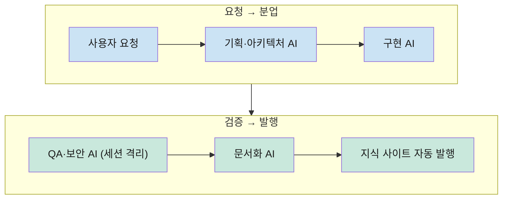

# 🚀 권태향(GRIT) 포트폴리오 — AI-Native 개발자

> **생성형 AI를 '보조 도구'가 아니라 '운영 시스템'으로 쓰는 개발자입니다.**
> 🌐 운영 중인 지식 사이트: https://capernaum-user.github.io/geunseong-ai-hub/

매일 새벽 1시, 제 PC에서는 사람 개입 없이 AI가 그날의 AI 뉴스를 수집·정리하고, 전문용어를 용어사전에 등록하고, 2인 대화 팟캐스트 음성을 합성하고, 요약 인포그래픽을 생성해 지식 사이트에 발행합니다. 이 저장소는 그런 시스템들을 만들어 온 기록입니다.

---

## 🤖 Part 1. AI 시스템 프로젝트 (개인 · 2026)

### 1) Cosmos Knowledge — 무인 콘텐츠 파이프라인을 갖춘 자체 학습 플랫폼 `비공개 · 시연 가능`
- **무인 발행**: 매일 새벽 AI가 뉴스 수집 → 정리 → 용어사전 자동 등록 → 2인 대화 TTS 팟캐스트 → 인포그래픽 생성 → 사이트 빌드까지 자동 실행 (Windows 작업 스케줄러 + AI 헤드리스 모드)
- **규모**: 카테고리 11개 · 노트 167개 · 전 문서 한/영 이중언어 · 끊긴 내부링크 0건 유지(자작 링크 검사기)
- **학습 기능**: 용어 상호링크, 지식 그래프 뷰, 오디오 학습(멀티스피커 TTS), 다이어그램 가독성 자동 보정
- **연동**: 외부 AI 에이전트 조직의 업무 기록을 자동 수신·게시하는 REST API

### 2) Agent Office v2 — 4층 AI 가상 오피스 `비공개 · 시연 가능`
- 1층 접수(자연어 요청 → 의존성 그래프 분해) → 2층 분석·디자인 → 3층 프로덕션 빌드 → 4층 결재(암호 서명 후에만 발행)
- **층별 전용 벡터DB(RAG)** — 각 층 에이전트가 자기 전문 지식을 임베딩 색인으로 축적 (1,100+ 청크)

### 3) [AI-Nexus](https://github.com/Capernaum-user/ai-nexus) — 3-AI 교차검증 오케스트레이션 엔진 `공개`
- **Gemini(두뇌: 분석·계획·판단) + Claude(손: 실행·검증) + Codex(감사: 독립 코드 심사)** — 서로의 결과를 교차 검토하는 14단계 파이프라인 (Python)
- 단일 AI의 한계(환각·자기확신)를 시스템 설계로 보완하는 접근

### 4) [ai-terminal-pane-status](https://github.com/Capernaum-user/ai-terminal-pane-status) — 오픈소스 도구 `공개`
- 분할 터미널에서 여러 AI를 동시 운용할 때 패널별 "어느 폴더 · 무슨 작업 · 작업중/대기/확인"을 실시간 표시
- 단일 파일 원클릭 설치 스크립트로 배포 — 실무 불편을 남이 쓸 수 있는 도구로 완성한 사례

### 5) [근성 AI 지식허브](https://capernaum-user.github.io/geunseong-ai-hub/) — 운영 중인 공개 지식 사이트
- Obsidian 로컬 노트 → Quartz 정적 사이트 자동 발행 파이프라인 ([저장소](https://github.com/Capernaum-user/geunseong-ai-hub))

### 6) ChannelDock — 멀티채널 커머스 통합 `비공개`
- OAuth 연동·재고 동기화 등 실서비스급 기능을 **자동 테스트 378개 통과** 상태로 마감
- AI와 함께 개발하더라도 품질 게이트(구현·테스트 분리)를 지키며 일한다는 증거

---

## 🎓 Part 2. 팀 프로젝트 (스마트인재개발원 · 2026.05 수료)

### 1) [핵심 프로젝트] Code Powered Urban Harvest (코드포닉스)
- **진행 기간**: 2025.12.29 ~ 2026.02.13
- **프로젝트 성격**: 아쿠아포닉스 지능형 통합 관리 시스템
- **주요 기능**:
    - IoT 센서 기반 실시간 수질 및 환경 모니터링
    - 웹 기반 대시보드 및 원격 제어 인터페이스
    - 데이터 기반 재배 일지 및 리포트 자동 생성
- **기술 스택**: HTML5, CSS3, JavaScript (Vanilla JS), IoT Data Integration
- **주요 산출물**: [코드 및 문서 바로가기](./01_Core_Project_Codeponics)

### 2) [실전 프로젝트] MDTS · M-Medic (선박 응급의료 엣지 AI 통합 솔루션)
- **진행 기간**: 2026.03.20 ~ 2026.05.15 (최종 발표 완료)
- **프로젝트 성격**: 선박이라는 고위험 산업 현장의 응급 상황을 위한 엣지 AI 통합 솔루션
- **주요 내용**:
    - Jetson / Raspberry Pi 센서 및 외상 카메라 기반 현장 데이터 수집
    - 엣지 AI를 활용한 선박 이상 징후 감지 및 분석, PyQt5 현장 단말
    - 요구사항 분석, DB 설계, 화면 설계 등 체계적인 소프트웨어 공학 기법 적용
- **기술 스택**: Edge AI (Jetson/RPi), Python(PyQt5), React(Vite), Database(SQL/NoSQL), System Design
- **주요 산출물**: [설계 문서 바로가기](./02_Final_Project_MDTS) · [웹 데모 저장소](https://github.com/Capernaum-user/live-maritime-medic)

---

## ⚙️ 일하는 방식 — AI를 조직처럼 운영합니다

- **삼권분립 QA**: 구현하는 AI와 테스트하는 AI를 반드시 분리 — 환각·자기확신 오류를 구조로 차단
- **하네스 엔지니어링**: CLAUDE.md · AGENTS.md · GEMINI.md 설정 계층으로 모든 AI에 동일한 규칙(명명·보안·품질) 주입
- **자동화 우선**: 반복 작업은 야간 스케줄러 + AI 헤드리스 실행으로 무인화
- **기록 문화**: 모든 작업·실패·교훈을 지식 볼트에 축적해 다음 작업에 재사용

---

## 🛠 Skills & Competencies

- **AI Engineering**: 멀티에이전트 오케스트레이션(Claude·Gemini·Codex), RAG/벡터DB, 프롬프트·하네스 엔지니어링, TTS·이미지 생성 파이프라인
- **Backend/Data**: Python, Node.js, REST API, Database Design (ERD), IoT Data Handling
- **Frontend**: HTML5, CSS3, JavaScript, React(Vite)
- **Edge/IoT**: Jetson, Raspberry Pi, 센서 연동, PyQt5
- **Ops**: Windows 자동화(작업 스케줄러·PowerShell), Git/GitHub

---

## ✉️ Contact

- **Email**: userkek@gmail.com
- **GitHub**: [github.com/Capernaum-user](https://github.com/Capernaum-user)
